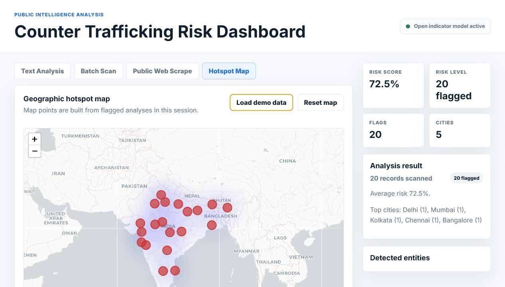

# Counter Trafficking Risk Dashboard

Counter Trafficking Risk Dashboard is a Flask-based intelligence prototype for analyzing public text, batch records, and public webpages for trafficking-risk indicators. It combines a professional HTML, CSS, and JavaScript interface with a Python backend, transparent risk scoring, optional open-source model fine-tuning, and geographic hotspot mapping.

## Result Preview



## Project Value

This project is designed as an industry-ready applied AI system, not just a basic classifier. It demonstrates full-stack implementation, NLP reasoning, public web text extraction, risk scoring, entity extraction, batch processing, and geospatial visualization in one workflow.

The strongest value is that the system remains usable before fine-tuning. It includes a transparent indicator-based scoring model for immediate demonstrations, while also supporting future fine-tuning with an open-source transformer model.

## Core Features

- Professional white dashboard built with HTML, CSS, and JavaScript
- Flask backend with JSON APIs
- Single text analysis
- Batch TXT, CSV, and JSON scanning
- Public webpage text extraction and analysis
- Risk score, risk level, flag count, and detected city output
- Entity extraction for cities, phone numbers, and names when spaCy is available
- Leaflet hotspot map with heatmap and city markers
- Demo map loader with 20 sample records across Indian cities
- Optional DistilRoBERTa fine-tuning pipeline
- No pickle model dependency
- No legacy Gradio interface

## Technical Architecture

```text
Browser UI
HTML, CSS, JavaScript

Flask API
app.py

Risk Engine
Indicator scoring model
Optional fine-tuned DistilRoBERTa model

Data Inputs
Manual text
Batch files
Public webpage scraping
Demo map records

Visualization
Leaflet map
Leaflet heat layer
City marker overlays
```

## Risk Scoring Approach

The application currently uses a transparent open indicator scoring model. It checks for weighted trafficking-risk patterns across categories such as control, movement, isolation, age vulnerability, transaction language, and secrecy.

When a fine-tuned model is available at `models/trafficking-roberta`, the app automatically loads it and combines transformer inference with indicator scoring.

Default open-source base model for fine-tuning:

```text
distilroberta-base
```

## Demo Data

The project includes 20 additional demo records for map visualization:

```text
training_data/demo_map_records.csv
```

These records are used by the `Load demo data` button in the Hotspot Map tab. They populate the map across cities including Delhi, Mumbai, Kolkata, Chennai, Bangalore, Hyderabad, Jaipur, Nagpur, Raipur, and others.

## Folder Structure

```text
app.py
fine_tune.py
requirements.txt
gitattributes
templates/index.html
static/styles.css
static/app.js
training_data/sample_train.csv
training_data/demo_map_records.csv
docs/result-webpage.png
models/trafficking-roberta
```

## Installation

```bash
pip install -r requirements.txt
```

If PyTorch installation fails on your Python version, install a compatible PyTorch build from the official PyTorch instructions, then rerun the remaining dependencies.

## Run the Application

```bash
python app.py
```

Open the local dashboard:

```text
http://127.0.0.1:7860
```

## Fine-Tune the Model

Use a labeled CSV or JSON dataset with the following columns:

```text
text,label
```

Allowed labels:

```text
BENIGN
TRAFFICKING
```

Run fine-tuning:

```bash
python fine_tune.py --data training_data/sample_train.csv --epochs 3
```

The trained model is saved to:

```text
models/trafficking-roberta
```

After training, restart the Flask app. The backend will automatically load the fine-tuned model.

## API Endpoints

```text
GET  /
POST /api/analyze
POST /api/batch
POST /api/scrape
GET  /api/map
POST /api/demo-map
POST /api/reset-map
```

## Interview Positioning

This is a strong interview project when presented as an applied AI prototype. It shows practical engineering beyond a notebook model:

- End-to-end product thinking
- Frontend and backend integration
- NLP-based risk analysis
- Open-source model fine-tuning path
- Public web scraping pipeline
- Geospatial intelligence visualization
- Ethical awareness around sensitive AI use

Recommended explanation:

```text
I built a full-stack public intelligence dashboard that analyzes public text and webpages for trafficking-risk indicators, assigns a transparent risk score, extracts locations, and visualizes hotspots on an interactive map. The system works immediately with an indicator-based model and can be upgraded through DistilRoBERTa fine-tuning on labeled data.
```

## Limitations

This is a prototype and should not be treated as an operational law-enforcement system without validation. The risk score is decision support only. Real deployment would require high-quality labeled data, expert review, bias testing, privacy controls, audit logging, and measured precision, recall, and F1 score.

## Responsible Use

Use only lawful, authorized, public, or consented data. Do not upload private survivor information, confidential case files, or personally sensitive data without proper authorization. Predictions must be reviewed by qualified professionals before any action.
